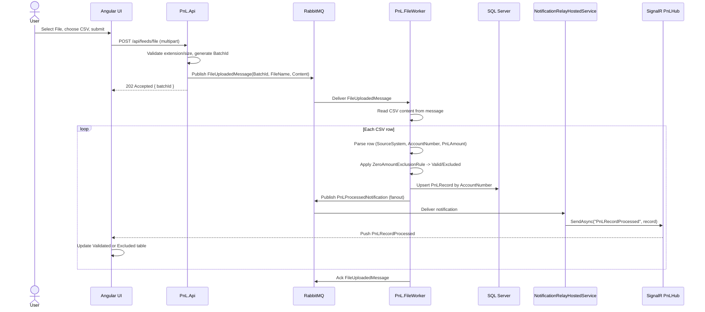
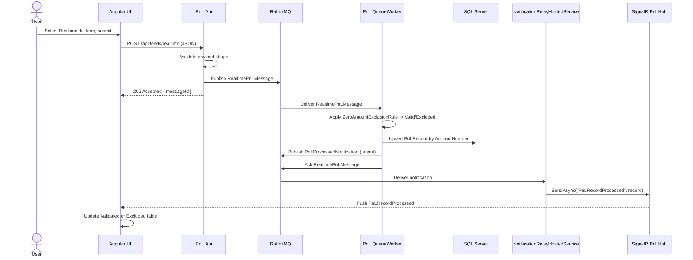
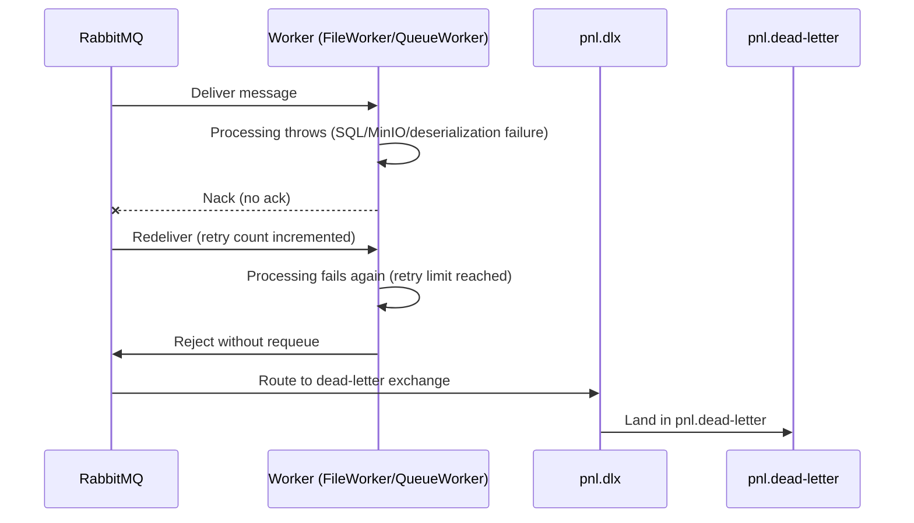

# Detailed Workflow

## 1. Components

```text
Angular UI
  - Captures CSV files and realtime PnL entries
  - Displays validated and excluded records

PnL.Api
  - Receives UI requests
  - Validates CSV files and publishes their content through RabbitMQ
  - Serves reports
  - Hosts SignalR hub

RabbitMQ
  - Queues ingestion messages
  - Routes processing notifications
  - Provides retry and dead-letter handling

PnL.FileWorker
  - Consumes file-upload messages
  - Parses CSV content from messages

PnL.QueueWorker
  - Consumes realtime PnL messages

SQL Server
  - Stores the latest state for one row per AccountNumber

SignalR
  - Pushes processed-record updates to connected Angular clients
```

## 2. Sequence Diagrams

### 2.1 CSV File Upload Sequence



### 2.2 Realtime PnL Entry Sequence



### 2.3 Technical Failure and Dead-Letter Sequence



## 3. Common Processing Rule

Both input paths use the same processing logic:

```text
If PnLAmount == 0:
  Status = Excluded
  ExclusionReason = ZeroPnLAmount

If PnLAmount != 0:
  Status = Valid
  ExclusionReason = null
```

`PnLAmount == 0` is a business outcome, not a technical failure. It is persisted and reported normally. It does not go to the dead-letter queue.

## 4. Application Startup Workflow

1. Docker Compose starts SQL Server, RabbitMQ, `PnL.Api`, `PnL.FileWorker`, `PnL.QueueWorker`, and the Angular UI.
2. `PnL.Api` waits for SQL Server and applies EF Core migrations.
3. RabbitMQ exchanges and queues are declared if they do not already exist.
4. `PnL.Api` starts the SignalR hub at `/hubs/pnl`.
5. `NotificationRelayHostedService` starts consuming the notification queue.
6. `PnL.FileWorker` starts consuming the file-upload queue.
7. `PnL.QueueWorker` starts consuming the realtime queue.
8. Angular loads and connects to the API SignalR hub.

## 5. Angular Initial Load Workflow

1. The user opens the Angular application.
2. Angular establishes one SignalR connection to `/hubs/pnl`.
3. Angular calls:
   - `GET /api/pnl/validated`
   - `GET /api/pnl/excluded`
4. `ReportsController` queries SQL Server through the Application repository abstraction.
5. Angular displays two tables:
   - Validated PnL
   - Excluded PnL
6. Angular keeps listening for the `PnLRecordProcessed` SignalR event.

## 6. CSV File Workflow

### 6.1 User selects and submits a file

1. The user selects `File` in the feed-type dropdown.
2. Angular enables the CSV file input.
3. The user selects a CSV file.
4. Angular sends a multipart request:

```http
POST /api/feeds/file
Content-Type: multipart/form-data
```

5. The CSV is sent as raw file content. Angular does not parse or apply business rules to the rows.

### 6.2 API accepts the file

6. `FeedsController` receives the multipart request.
7. The API validates basic transport information:
   - file exists
   - file has an allowed CSV extension
   - file size is within the configured limit
8. The API generates a new `BatchId` for this upload request.
9. The API creates a `FileUploadedMessage` containing the bounded CSV payload:

```json
{
  "batchId": "batch-guid",
  "fileName": "input.csv",
  "content": "<base64-encoded CSV bytes>"
}
```

10. The API publishes the message to the RabbitMQ file-ingestion route. The configured upload limit must keep the serialized message below the broker's maximum message size.
11. The API returns `202 Accepted` with the `BatchId`.
12. The UI can show that the batch was accepted for asynchronous processing.

### 6.3 FileWorker consumes the upload message

13. `FileFeedConsumer` in `PnL.FileWorker` receives the message from RabbitMQ.
14. The worker confirms that the message contains a valid `BatchId`, file name, and content.
15. The worker reads the CSV content from the message and parses the header:

```csv
SourceSystem,AccountNumber,PnLAmount
```

16. The worker reads the bounded message content row by row; the complete CSV payload is already present in the message.
17. For each row, it converts:
   - `SourceSystem` to `string`
   - `AccountNumber` to `int`
   - `PnLAmount` to `int`
18. The worker passes each parsed row to the shared record-processing use case.

### 6.4 Each CSV row is processed

19. The shared processing logic evaluates `PnLAmount`.
20. The record is assigned either `Valid` or `Excluded` status.
21. The record is assigned `FeedSource = File`.
22. The record is assigned the current file's `BatchId`.
23. The repository searches for an existing row by `AccountNumber`.
24. If the account does not exist, a new `PnLRecord` is inserted.
25. If the account already exists, its current values are updated:
   - `SourceSystem`
   - `PnLAmount`
   - `Status`
   - `ExclusionReason`
   - `FeedSource`
   - `BatchId`
   - `CapturedAtUtc`
26. SQL changes are saved.
27. The worker publishes a `PnLProcessedNotification` for the processed row.
28. The worker continues with the next CSV row.

### 6.5 File completion

29. After all rows are processed, the worker acknowledges the RabbitMQ file message.
30. The worker may log the batch result, including processed and excluded counts.

## 7. Realtime PnL Workflow

### 7.1 User submits one record

1. The user selects `Realtime` in the feed-type dropdown.
2. Angular displays fields for:
   - `SourceSystem`
   - `AccountNumber`
   - `PnLAmount`
3. The user enters the values and submits the form.
4. Angular sends:

```http
POST /api/feeds/realtime
Content-Type: application/json
```

```json
{
  "sourceSystem": "ABC",
  "accountNumber": 1001,
  "pnlAmount": 250
}
```

### 7.2 API publishes the realtime message

5. `FeedsController` receives the request.
6. The API checks the basic request values and data types.
7. The API creates a realtime message.
8. The API publishes it to the RabbitMQ `pnl.realtime` queue.
9. The API returns `202 Accepted`.
10. The API does not apply the final business rule or write the SQL row directly.

### 7.3 QueueWorker processes the message

11. `RealtimeFeedConsumer` in `PnL.QueueWorker` receives the message.
12. The worker deserializes the message.
13. The worker passes it to the same shared record-processing use case used by `FileWorker`.
14. The business rule determines whether the record is `Valid` or `Excluded`.
15. The record is assigned `FeedSource = Realtime`.
16. The repository searches for the account by `AccountNumber`.
17. If the account does not exist, a new row is inserted.
18. If the account exists, its values are updated in place.
19. `CapturedAtUtc` is updated to the current UTC time.
20. SQL changes are saved.
21. The worker publishes a `PnLProcessedNotification`.
22. The worker acknowledges the RabbitMQ message.

## 8. Notification and SignalR Workflow

This flow is common to both FileWorker and QueueWorker.

1. A worker finishes processing and saving a record.
2. The worker creates a notification containing values such as:

```json
{
  "accountNumber": 1001,
  "sourceSystem": "ABC",
  "pnlAmount": 250,
  "status": "Valid",
  "feedSource": "Realtime",
  "exclusionReason": null,
  "batchId": null
}
```

3. The worker publishes the notification to the RabbitMQ `pnl.notifications` fanout exchange.
4. RabbitMQ delivers the notification to the API notification queue.
5. `NotificationRelayHostedService` consumes the notification.
6. The relay calls `IHubContext<PnLHub>`.
7. The API broadcasts the `PnLRecordProcessed` event to all connected Angular clients.
8. Angular receives the event through its single SignalR connection.
9. Angular checks the record status:
   - `Valid` -> add or update the Validated PnL table
   - `Excluded` -> add or update the Excluded PnL table
10. If an account changes from Valid to Excluded, Angular removes it from the Validated table and places it in the Excluded table.
11. If an account changes from Excluded to Valid, Angular removes it from the Excluded table and places it in the Validated table.

## 9. Reporting Workflow

1. Angular initially loads data by calling the reporting endpoints.
2. `ReportsController` receives the request.
3. The Application query applies the requested status filter.
4. The repository queries `PnLRecords` using EF Core.
5. The query can filter by `SourceSystem` and apply pagination.
6. The API returns the current state of the accounts.
7. Angular renders the result in the appropriate table.
8. SignalR handles changes that occur after the initial load.
9. If a SignalR connection is lost, Angular reconnects and reloads the reporting endpoints to avoid missing updates.

## 10. Validation and Technical Failure Workflow

### 10.1 Business exclusion

1. A row has `PnLAmount = 0`.
2. The business rule assigns `Status = Excluded`.
3. The row is saved to SQL.
4. A notification is published.
5. The UI displays the row in the Excluded PnL table.
6. The RabbitMQ message is acknowledged.
7. The message does not enter the DLQ.

### 10.2 Invalid CSV row

1. The parser cannot convert a required field, for example `AccountNumber = abc`.
2. The worker records the row-level parsing error in the log.
3. The worker skips the malformed row and continues with the next row for this POC.
4. Successfully parsed rows in the same file continue through normal processing.
5. The batch completion log includes the parsing error count.

### 10.3 Technical processing failure

1. A worker cannot connect to SQL Server or RabbitMQ, or encounters an unexpected exception.
2. The worker does not acknowledge the message as successfully processed.
3. RabbitMQ retries or redelivers the message according to the configured retry policy.
4. After the retry limit is reached, the message is routed to the dead-letter queue.
5. The business data is not presented as a normal excluded record because this is a technical failure.

### 10.4 Malformed RabbitMQ message

1. The worker receives a message that cannot be deserialized.
2. The worker logs the message failure.
3. The worker rejects the message without requeue after the configured retry policy.
4. RabbitMQ routes it to the dead-letter queue.
5. The worker continues consuming later messages.

## 11. Re-upload and Upsert Workflow

1. The user uploads a CSV that was uploaded previously.
2. The API generates a new `BatchId`.
3. The API publishes a new file-upload message containing the CSV bytes.
4. The FileWorker processes the rows again.
5. For each account, the repository searches by `AccountNumber`.
6. Existing accounts are updated rather than inserted as duplicate rows.
7. New accounts are inserted.
8. The UI receives updates for the current values.
9. SQL continues to contain one row per `AccountNumber` for this POC.

## 12. End-to-End Examples

### Valid realtime record

```text
UI submits ABC / 1001 / 250
  -> API accepts request
  -> RabbitMQ pnl.realtime
  -> QueueWorker consumes
  -> Status = Valid
  -> SQL upsert
  -> pnl.notifications exchange
  -> API notification relay
  -> SignalR PnLRecordProcessed
  -> Validated PnL table
```

### Excluded realtime record

```text
UI submits ABC / 1002 / 0
  -> API accepts request
  -> RabbitMQ pnl.realtime
  -> QueueWorker consumes
  -> Status = Excluded
  -> SQL upsert with ZeroPnLAmount
  -> pnl.notifications exchange
  -> API notification relay
  -> SignalR PnLRecordProcessed
  -> Excluded PnL table
```

### CSV batch

```text
UI uploads CSV
  -> API publishes bounded CSV content in FileUploaded message
  -> FileWorker consumes message
  -> FileWorker parses CSV content from message
  -> each row uses shared processing logic
  -> SQL upsert per AccountNumber
  -> notification per processed row
  -> SignalR updates Angular tables
```

## 13. Component Responsibilities

| Component | Responsibility | Does not do |
|---|---|---|
| Angular UI | Collect input, call API, display reports, receive SignalR events | Apply final business validation or write SQL |
| `FeedsController` | Accept file/realtime requests and publish messages | Parse CSV rows or process PnL business rules |
| `ReportsController` | Return current report data | Consume RabbitMQ ingestion messages |
| `FileWorker` | Parse and process CSV content from RabbitMQ messages | Host HTTP endpoints or SignalR |
| `QueueWorker` | Process realtime queue messages | Host HTTP endpoints or SignalR |
| Application layer | Orchestrate use cases and repository calls | Depend on SQL or RabbitMQ implementation details |
| Domain rule | Decide Valid versus Excluded | Read files, call SQL, or publish messages |
| RabbitMQ | Transport asynchronous messages | Apply business rules or store report data |
| SQL Server | Persist current account state | Push live updates to browsers |
| `NotificationRelayHostedService` | Convert RabbitMQ notifications into SignalR broadcasts | Process ingestion messages |
| SignalR | Push processed updates to connected browsers | Persist records |

## 14. Final Verification Checklist

1. Start the stack with `docker compose up -d --build`.
2. Open the Angular UI and verify the SignalR connection succeeds.
3. Verify initial report requests populate both tables.
4. Submit a valid realtime record and verify it appears in the Validated table.
5. Submit a zero-PnL realtime record and verify it appears in the Excluded table.
6. Upload a CSV containing both non-zero and zero PnL rows.
7. Verify each row is processed and the correct table is updated.
8. Upload the same CSV again and verify existing accounts are updated, not duplicated.
9. Verify malformed CSV rows are logged and do not stop valid rows from processing.
10. Verify a malformed RabbitMQ message reaches the DLQ.
11. Verify SQL contains one current row per `AccountNumber`.
12. Stop and restart the API, then verify Angular reconnects and reloads current report data.
