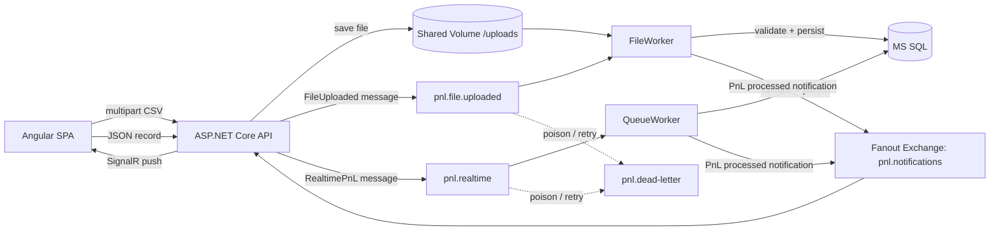

# POC Workflow Diagram

## How CSV is handled after upload

1. The Angular SPA sends a multipart upload to the API endpoint: `POST /api/feeds/file`.
2. The API validates the file name, extension, and size.
3. The API creates a `BatchId` and saves the uploaded file to the shared volume mounted in Docker.
4. The API does not parse the CSV itself. It publishes a lightweight claim-check message such as:
   - `BatchId`
   - `FileName`
   - `FilePath`
5. The FileWorker consumes the `pnl.file.uploaded` message.
6. The FileWorker reads the file from the shared volume and parses it row by row.
7. For every row, it validates:
   - `SourceSystem` is present and valid
   - `AccountNumber` is integer
   - `PnLAmount != 0`
8. If `PnLAmount == 0`, the row is marked as excluded and saved to the database as excluded data.
9. If `PnLAmount != 0`, the row is marked as valid and saved as valid data.
10. The worker then publishes a notification to the RabbitMQ fanout exchange.
11. The API receives the notification and broadcasts it to the Angular UI through SignalR.
12. The SPA refreshes the valid and excluded tables in real time.

## Important design choice

The API uploads the file and immediately returns `202 Accepted`, so the user does not wait for the whole file to be processed. The actual heavy lifting happens in the FileWorker, keeping the API thin and aligned with clean architecture.

## Duplicate / reliability handling

- Every row gets a unique `MessageId` for idempotency.
- A database unique index prevents duplicate insertions.
- Failed messages with repeated errors move to the dead-letter queue.
- The file is processed asynchronously to keep the API responsive.
